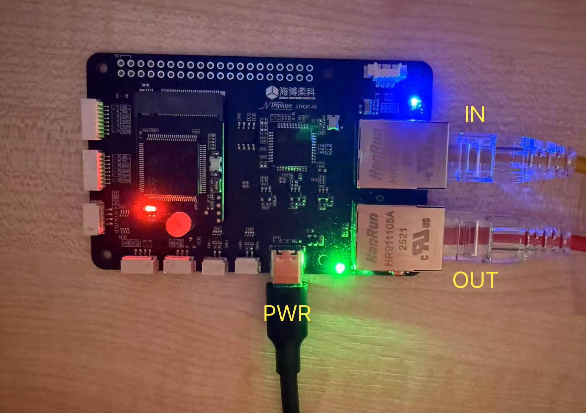

## AIM EtherCAT - Custom Slave Control Board

**MCU**: STM32H750

**ESC**: AX58100

**Support Tasks**:

* RC
    * DBUS
    * SBUS
* ACTUATOR
    * LK
    * DM
    * DJI
    * DSHOT
    * PWM (Onboard 4x2 channel)
    * PWM (External 4x4 channel)
* SENSOR
    * HIPNUC IMU (CAN2)
    * MS5837 PRESSURE SENSOR (I2C)
    * PMU (CAN2, UAVCAN PROTOCOL ONLY)

~~Dev/Deploy tutorials are on the way...~~