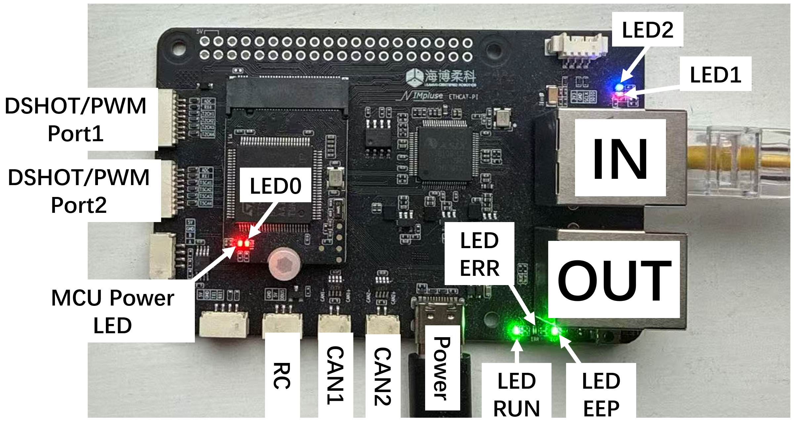

## AIM EtherCAT - Custom Slave Control Board

This project is a custom EtherCAT Slave implementation running on an **STM32H750** microcontroller with an **AX58100**
EtherCAT Slave Controller (ESC). It leverages the **SOES** (Simple Open EtherCAT Slave) stack to provide real-time
control for various robotics peripherals.

## Hardware Specifications

* **MCU**: STM32H750VBTx (ARM Cortex-M7)
* **ESC**: AX58100
* **Communication Interface**: EtherCAT (SPI to ESC)

## Features

* **Dynamic Task Loading**: Tasks are instantiated dynamically based on arguments received from the EtherCAT Master
  during initialization, allowing for flexible configuration without recompiling.
* **Real-time Control**: Uses FreeRTOS for task scheduling and synchronization.
* **Safety Mechanisms**:
    * Safe state handling for actuators upon connection loss.
    * System reset after EtherCAT state change (From `any` to `Init`).

## Support Tasks

### Tested & Verified

They're tested by various test cases, and should be working fine.

* **Remote Controller**
    * **DBUS**: DJI DT7/DR16 RC system
    * **SBUS**: Standard Futaba SBUS protocol
* **Actuators**
    * **LKTECH Motors**: CAN bus control for motors from `Shanghai Lingkong Technology Co., Ltd.`
    * **DAMIAO Motors**: CAN bus control for motors from `Shenzhen Damiao Technology`
    * **DJI RoboMaster Motors**: CAN bus control for `DJI RoboMaster GM series` motors
    * **DSHOT**: Digital protocol for drone ESCs (DSHOT600)
    * **PWM (Onboard)**: Standard PWM output (4x2 channels)
* **Sensors**
    * **HIPNUC IMU (CAN)**: Custom `HIPNUC` ch0x0 series imu forward board

### Untested

They're probably not working or are not working properly.

* **Actuators**
    * **PWM (External)**: External PWM expansion (4x4 channels) via UART
* **Sensors**
    * **MS5837**: Pressure sensor (I2C interface)
    * **PMU**: Power Management Unit (UAVCAN Protocol)
    * **ADC**: Analog-to-Digital Converter readings

## Status Indicators (LEDs)

The board uses onboard LEDs to indicate system status.

|     **LED**     |               **State**                |                                        **Description**                                         |
|:---------------:|:--------------------------------------:|:----------------------------------------------------------------------------------------------:|
| **LED0 & LED1** | **LED0** Blinking (4Hz), **LED1** Off  |                   Slave is currently **not** in **OP** (Operational) state.                    |
| **LED0 & LED1** | **LED0** Blinking (40Hz), **LED1** On  |     Task list **received** from Master and **loaded**; Slave is currently in **OP** state.     |
| **LED0 & LED1** | **LED0** Blinking (40Hz), **LED1** Off | Task list **received** from Master and **loaded**, but connection to Master has been **lost**. |
|    **LED2**     |                  Off                   |                   ESC (EtherCAT Slave Controller) initialization **failed**.                   |
|    **LED2**     |                   On                   |                               ESC initialization **succeeded**.                                |
|     **EEP**     |                   On                   |                              ESC **successfully** loaded EEPROM.                               |
|     **EEP**     |                Blinking                |                                 ESC **failed** to load EEPROM.                                 |
|    **ERROR**    |                   On                   |                          Communication **fault** between MCU and ESC.                          |
|    **ERROR**    |                  Off                   |                            MCU and ESC communication is **normal**.                            |
|     **RUN**     |                   On                   |                                   Slave is in **OP** state.                                    |
|     **RUN**     |                  Off                   |                                 Slave is **not** in OP state.                                  |

## Additional Info

* EtherCAT currently running in `Free-run` mode.
* SOES are added as a submodule. For first-time initialization, please use the command ``git submodule update --init --recursive``

## Sponsors & Partners

We would like to thank [**RT-Labs**](https://rt-labs.com) for supporting our project.  

## Maintainer

* Hang (scyhx9@nottingham.ac.uk)
